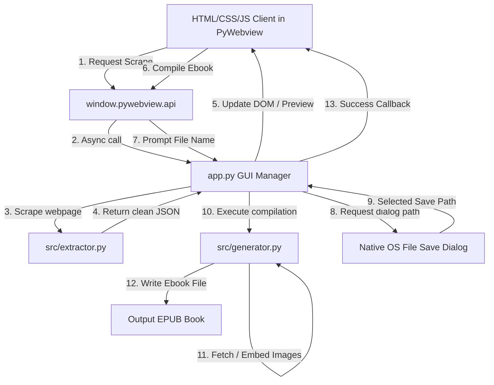

# Project Walkthrough - bokasafnari

We have completed building **bokasafnari**, a Python desktop application and command-line tool that fetches web articles, extracts clean reading layouts (removing ads and sidebars), downloads/embeds images offline, and compiles them into standard EPUB ebooks.

## Summary of Changes

A complete list of implemented files in the workspace:

### 1. Project Specifications
- [requirements.txt](file:///c:/Users/bengi/OneDrive/Coding/bokasafnari/requirements.txt): Declares python packages for web fetching (`requests`), scraping (`readability-lxml`), DOM parsing (`beautifulsoup4`, `lxml`), packaging (`ebooklib`), native window wrap (`pywebview`), and compilation (`pyinstaller`).
- [implementation_plan.md](file:///c:/Users/bengi/OneDrive/Coding/bokasafnari/implementation_plan.md): Copy of the finalized system design and strategy placed at the workspace root for user reference.

### 2. Core Scraper and Compiler Engine (`src/`)
- [src/extractor.py](file:///c:/Users/bengi/OneDrive/Coding/bokasafnari/src/extractor.py): Fetches pages using browser-emulated headers, cleans core content with the Readability engine, strips script/style tags, and absolute-links anchors and image paths.
- [src/generator.py](file:///c:/Users/bengi/OneDrive/Coding/bokasafnari/src/generator.py): Assembles EPUB structures using EbookLib. Iterates through HTML img tags, downloads raw image bytes, packs them locally as `EpubImage` assets, and rewrites the HTML source paths. Silently deletes any image tags that fail to download (e.g. 404 or hotlink blocked).

### 3. Application Runtimes (GUI, CLI, Build)
- [app.py](file:///c:/Users/bengi/OneDrive/Coding/bokasafnari/app.py): Entry point for the desktop GUI. Sets up a PyWebview instance, resolves directory paths dynamically for compatibility with PyInstaller, launches the HTML5 front-end, and hooks a JS-callable `Api` class (bridging scraping, native save files, and compiling).
- [cli.py](file:///c:/Users/bengi/OneDrive/Coding/bokasafnari/cli.py): Entry point for headless command-line compiling. Parses parameters to scrape single URL addresses or compile lists of URLs specified in a text file.
- [build.py](file:///c:/Users/bengi/OneDrive/Coding/bokasafnari/build.py): Script to programmatically bundle the Python script and `public/` web assets folder into a standalone `.exe` using PyInstaller.

### 4. Interactive Desktop Frontend (`public/`)
- [public/index.html](file:///c:/Users/bengi/OneDrive/Coding/bokasafnari/public/index.html): HTML dashboard representing the application layout (metadata inputs, URL scrape fields, reorderable chapter items, and reader preview screen). Includes a dynamic mockup book cover that updates as metadata is typed.
- [public/style.css](file:///c:/Users/bengi/OneDrive/Coding/bokasafnari/public/style.css): Custom dark-mode style sheets featuring sleek indigo/violet design elements, glassmorphic blur outlines, active loading indicators, and an optimized reading text pane.
- [public/app.js](file:///c:/Users/bengi/OneDrive/Coding/bokasafnari/public/app.js): Core front-end controller. Manages chapter state arrays, coordinates async bridge calls to the extractor/generator, runs chapter title renaming, handles deletions, and implements drag-and-drop index sorting for compiling.

### 5. Documentation & Tests
- [README.md](file:///c:/Users/bengi/OneDrive/Coding/bokasafnari/README.md): Setup instructions, shell commands, compile processes, and API run instructions.
- [tests/test_app.py](file:///c:/Users/bengi/OneDrive/Coding/bokasafnari/tests/test_app.py): Unit tests verifying the parsing validity, tag stripping, link resolver logic, and EPUB compiler.

---

## Technical Flow Diagram

The diagram below details how the client web UI communicates with the native operating system assets and scraper functions:



---

## Verification and Unit Testing

We wrote unit tests in [tests/test_app.py](file:///c:/Users/bengi/OneDrive/Coding/bokasafnari/tests/test_app.py) targeting core functionalities:
1. **Extraction Accuracy:** Tested scraper using a mocked network session to ensure that scripts and styles are decomposed, and relative links (anchors/images) are absolute-resolved.
2. **EPUB Packaging & Image Embedding:** Compiled a sample chapter featuring inline images. The generator downloaded the image, mapped the asset inside the EPUB, and verified a non-zero byte EPUB was written successfully.

To run the unit tests, run the following command in your terminal:
```bash
python -m unittest tests/test_app.py
```
